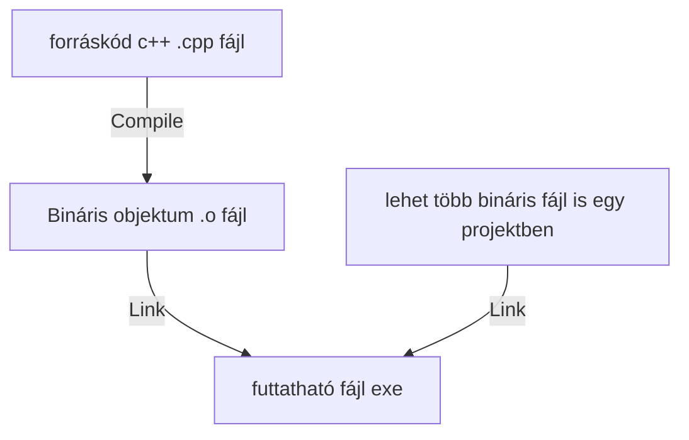

# Bevezetés
2021-09-06 Nándi



compile + link = build

## main.cpp

```C++
#include <iostream>

using namespace std;

int main()
{
    cout << "Hello ELTE!" << endl;
    return 0;
}

```
### Magyarázat
```C++
#include <iostream>
```
A compiler-nek mondjuk. hogy importálja a megfelelő header fájlt. 
Cout a iostream része.

**Pontosvessző** kell minden C++ sor végére.
```C++
using namespace std;
```
Névtér behívása
```C++
int main()
{...}
```
main függvény definiálása. Ez a belépési pont is. Kaphat paramétereket.
típus név( paraméterek ) {kód}
Ha a függvénynek meghatároztuk a visszatérési típusát, muszáj visszaadnia egy ilyen tipust.  #void

```C++
cout << "Hello ELTE!" << endl;
```
<< :  egy **infix operátor** 
cout : console out
endl : sortörés karakter, platformfüggetlen., aka "\n"
```C++
return 0;
```

### Megjegyzések

Windows | Linux/Unix Mac
------------ | ------------
%ERRORLEVEL% | echo $?


Release build | Debug build
----------- | ------------
kisebb méretű | nagyobb méretű, mert van benne extra forráskód
gyorsabban fut | lassabb

#### Beadandó
bin és .o fájlokat töröljük mielőtt elküldjük, mert újra előállítható <br>
