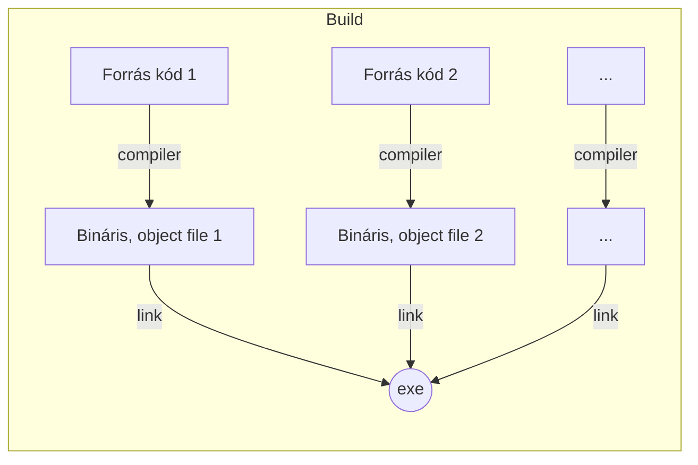

# Programozás gyakorlati jegyzet
- Készítő: Huszár Gergő
- Tárgy: Programozás, gyakorlat

---
1. Bevezető
2. Tantárgyi infók
   1. Órák váza
3. CODE::BLOCKS
---
# Bevezető
- Banki rendszereket epít az oktató
- Ha kell akkor gyakorlat/meló ügyben tud segíteni.
- http://progalap.elte.hu tárgyal kapcsolatos leírás
- http://biro.elte.hu beadandókat ellenőrzi
- Szerdánként nem kell bejárni
- Számonkérés
  - Minden óra elején 5 perces zh
    - 10 db
    - 2 pontot ér 1-1
    - Összesen min 10 pontot kell elérni
  - Beadandók (4-5 db)
    - Az egyikhez majd kell dokumentáció
  - 2-2 db algoritmus illetve kódolós zh
    - 1-1 csoportban
    - 1-1 évfolyamon

# Tantárgyi infók
## Órák váza
1. Specifikáció elkészítése
2. Hogyan oljuk meg a feladatot?
3. Megoldás elkészítése.

# CODE::BLOCKS
- Fordító

- Projekt átküldésekor csak a `.cbp` és a `.cpp` fájlokat kell elküldeni
  - Ezekből az egész projekt előállítható
