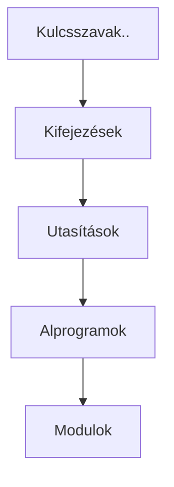

# Imperatív programozás első előadás
- Készítette: Huszár Gergő
- Tárgy: Imperatív programozás, előadás

---
1. Bevezetés
   1. Mi az imperatív programozás?
      1. Memória
   2. Programok felépülése
      1. Kifejezések
      2. Utasítások
   3. Kiírások
      1. Python
      2. C
   4. Típus
      1. C-ben
         1. Tömbök
         2. Poinerek/Mutatók
      2. Miért jók?
   5. Típus ellenőrzés
   6. Alprogramok
      1. Főprogram
   7. Megjegyzés
   8. Modul
2. Egyéb infók
---
# Bevezetés
- Kozsi Tamás
- A tárgyra sok minden épül
## Mi az imperatív programozás?
- Memóriában tárolt adatok folytonos változtatása
- C nyelv + pyton lesz kb. 4:1 arányban
- Utasítások, vezérlések
### Memória
- Bitekből áll
  - Ezeket fogja a program manipulálni
- Egyszerre több bittel dolgozun: 8 bit -> byte
- A byte-okat sorszámmal azonosítják
- pl.: int --> 4 byteon tárolja
  - a 4 byte egymás mellett lesz a memóriában
## Programok felépülése
- Kulcsszavak, literálok, operátor, egyéb jelek, azonosítók (változók neve)
- kifejezések 
  - pl.: x + 3
- Utasítások
- Alprogramok (függvények, rutinok, metódusok)
- Modulok (könyvtárak, osztályok, csomagok)
- Felépítés kicsitől nagyig:

### Kifejezések
- Literálok:
  - stringek
  - számok
- Bonyolúltabb kifejezések
  - `range(2,10)`
### Utasítások
- Értékadás
- Üresutasítás: pass, ;
- Alprogramhívás: for, while
- Elágazások
- Ciklusok
## Kiírások
### Python
1. ```py
   print(factorial(10))
   ```
2. ```py
   print("10! =", factorial(10), ", ln(10) = ", log(10))
   ```
### C 
1. ```c
   printf("%d\n", factorial(10));
   ```
     - %d - decimál típusú számot vár/ír ki
2. ```c
   printf("10! = %d, ln(10) = %f\n", factorial(10), log(10));
   ```
## Típus
- Egy értelmezési módot határoz meg
- Meghatározza milyen műveleteket lehet vele használni
- Meghatározza az érték felvételét
### C-ben
| Név     | Infó                  |
| :------ | :-------------------- |
| Int     | Egész számok          |
| Float   | Lebegőpontos számok   |
| char    | Karakter              |
| char[ ] | Karakterlánc = string |
| int[ ]  | Szám tömb             |
| int*    | Mutatók, Pointerek    |
#### Tömbök
- A memóriában mindig egymás után vannak az értékei
#### Poinerek/Mutatók
- A poiner csak a memóriacímet tárólja
### Miért jók?
- Változók rossz használatána kelkerülése
- Jobban érthető, hogy milyen típust vár vlmi
- Összetettebb dolgoknál is könnyebb a dolgunk
- A fordító programnak is egyszerűbb a dolga
## Típus ellenőrzés
- Fordítóprogram
- Hibás programokat kiszűri
- C
     - Fordítás közben
     - Statikus típusrendszer
- Python
     - Futásidőben
     - Dinamikus típusrendszer
- Gyengén típusos
  - Autómatikusan konvertálódik a az érték
- Szigorúan típusos
  - Szigorú szabályok
## Alprogramok (függvények)
- Több lépésből áll
- Újra felhasználható
- Kis kezelhető méretű számítások
### Fő program
- Innen idndúl a kód futása
- neve C-ben a `main` visszatérési értéke `int`
  - Siker esetén 0
## Megjegyzések
- Python: # ... 
  - Egy sor
- C: /*... */
  - Több sor
## Modul
- Összetartozó dolgok halmaza
  - Egymásra hivatkoznak
  - Együtt dolgoznak
  - Egymásra épűl működése
  - Legyen a lehető legkevesebb interakciója a többi modulal
- Több fájl esetén ha egy fájlban egy másik fájlban lévő függvényt hívunk meg szükséges az adott függvény deklarálása az adott fájlban is
- Különböző modulokból a `#include <>` segít betőlteni a függvényeket

# Egyéb infók
- 0x - hexadecimális szám
- 0 - 
- `&` címképző operátor
- gyakre szerverip: pandora.inf.elte.hu