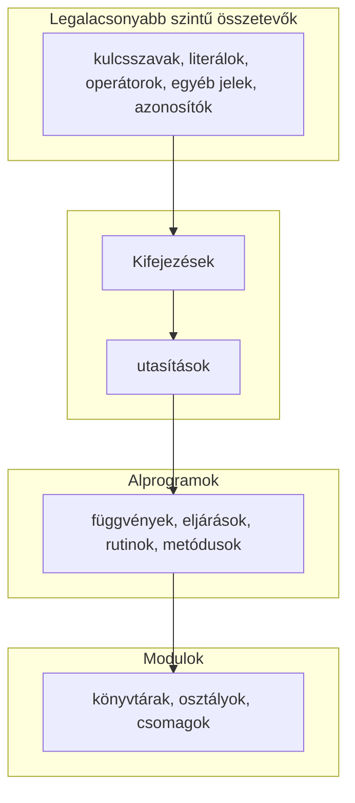

# Imperatív programozás
Nándi 2021.09.07
***
- A programot úgy fogalmazzuk meg hogy utasításokat írunk.
- Memóriát akarjuk használni, hogy adatokat tároljunk, változtassunk
****

Ilyen nyelv például a **C**.

## Memória
"Hosszú szallag, ami bitekből épűl."
A számítógépek bájtonként dolgoznak, legtöbbször 8bit 1byte.
A memória "indexelve" van.
Lefoglalunk N byte-ot a memóriában, amikor definiálunk egy változót.
>🗒️ int - A C compilerek általában 4byteon kezelik.


## Program felépítése



>🗒️ A legalacsonyabb szintű összetevők lehetnek egyedülálló kifejezések is.


# Nyelv alapjai

## Felépítés
vezérlési szerkezetek: elágazások, ciklusok stb
	while feltételből és ciklusmagból áll

### Magyarázat
```python
def factorial(n):
	result = 1
	for i in range(2,n+1):
		result *= i
	return result
```
- **def**  kulcsszó
- kettőspont egyéni jel 
- **for** utasitás: vezérlési szerkezet
	- **i** ciklusváltozó
	- törzs: 1db utasítás
- **return**  visszaadja az eredményt
>Python syntaxis:  indentálás alapján lehet eldönteni a működést


### Típusok
-kifejezik egy bitsorozat értelmezési müdját
meghatározzák, milyen értéket vehet fel egy változó
megkötik, hogy műveleteket milyen értékekkel végezhetünk el

#### 1. Alap típusok:
a c-implementációja határozza meg, hágy byte
- int #int
- float, (recionálisak részhalmaza), nem lehet mindegyiket ábrázolni, megkülönböztetni #float
- char (valójában számtipus #char
- char[] (karaktertömb) #char-tömb
- int[] #tömb
- int* mutatók (memória kezelés, manipuláció) #pointer 

#### 2. összetett adatokat: 
- struktúrákkal
#struct

#### Tömb
int (elemtípus) név[darab] = {1,2,3}
Ha 4byte az int, 12byte egymás után a memóriában 
>(nullától indexelünk mert a pointerhez nullát adva az első elemre mutat)

&-címképző operátór: memória címet ad vissza

típus szerepe
-hibák elkerülése miatt fontos ; típusellenőrzés
-kifejezik a programozó szándékát
- segíti az absztakció kialakítását
- segíti a hatékony kód generálását

> ** "A fordító az egyetlen barátod!" 😈**

## Alprogramok
-érdemes felbontani, hogy átlátható
- a főprogram biztosítja a belépési pontot, main
	- main lesz a főprogram c-ben


## Modul
- A program nagyobb egységei
- Összetartózó dolgok összefogása
- Egymásra hivatkoznak, van egy belső kohézió
- Modulok között lazább a kapcsolat, ritkán lépnek interakcióban 
- Tervezési cél, hogy függetlenek legyenek egymástól
- Absztrakt megvalósítás

### Példa működés

Be kell jelenteni, hogy létezik egy ilyen függvény
Deklarálni kell #prototípus 

### Heder fájlok
Ieklarációkat tartalmaz
Megmondj, hogyan kell használni a modult

## Print 
printf - formázó string, paraméterek ...

| formázó szöveg                                                                  | tipus           |
| ------------------------------------------------------------------------------- | --------------- |
| %d                                                                              | decimal integer |
| %f                                                                              | float           |
| [Info](https://www.tutorialspoint.com/c_standard_library/c_function_printf.htm) |                 |


***
#### Megjegyzések

| szintaktika | szemantika       |
| ----------- | ---------------- |
| Külalak     | Logiaki tartalom |


>Üres utasítás python **pass** C-ben **;**

> A "print" pythonban művelet. 

> Python **#** comment
> C-ben /\* comment \*/ ítöbbsoros


